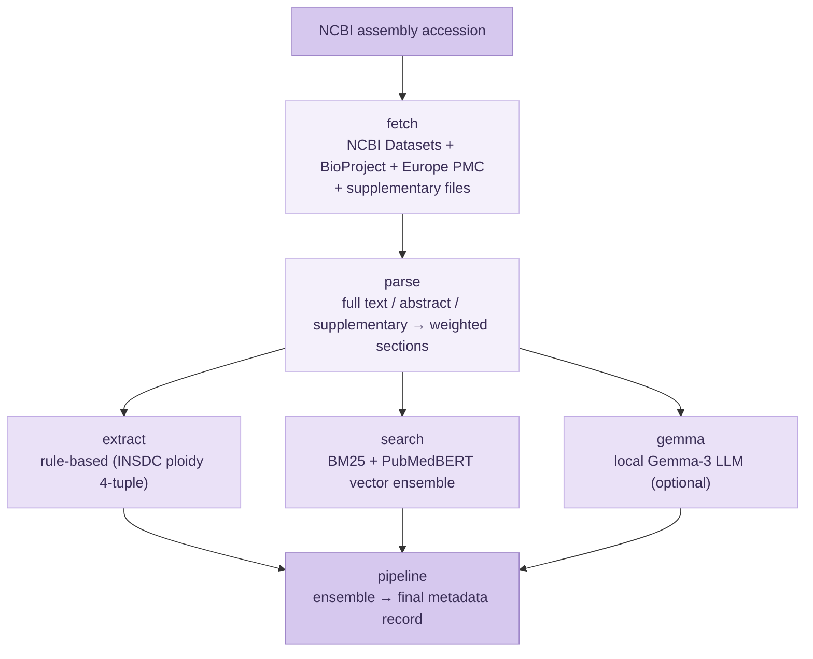

# Expand genome metadata in Ensembl with AI tools

**Contributor:** Soomin Lee  
**Mentors:** Disha Lodha, Jorge Alvarez-Jarreta  
**Organisation:** EMBL-EBI  
**Programme:** Google Summer of Code 2026  

---

## Project summary

Genome assemblies in INSDC are frequently missing curated biological metadata (ploidy, chromosome number, cultivar/strain, sex) even though those facts are stated in the assembly's own publication. Because ploidy, cultivar, and sex are optional or absent from most submission forms, an assembly can receive an accession while these fields stay empty, and Ensembl needs them to build accurate gene-tracking and comparative resources. Manual curation across thousands of assemblies does not scale. This project builds a Python pipeline that, given only an NCBI assembly accession, finds the assembly's paper, reads its text and supplementary files, and recovers that metadata into structured form, with a particular focus on plant ploidy as the hardest and most valuable case.

---

## What was built

The pipeline is a chain of modules, each doing one job. A guiding principle throughout is **grounded, abstaining extraction**: every value carries its supporting evidence, and the pipeline returns `null` rather than inventing an answer when the text is silent.

### Pipeline overview

### `fetch` — publication and supplementary-text retrieval

Resolves the assembly against NCBI Datasets and finds its source publication, escalating through sources only when a strong genome paper has not yet surfaced:

- Directly linked PMIDs from the NCBI assembly record, NCBI Entrez elink, and the BioProject reference paper
- Europe PMC search by scientific and common name, plus a full-text species-confirmation pass that recovers multi-species / methods papers naming the organism only in the body
- NCBI PMC and Semantic Scholar as final fallbacks
- All candidates are pooled, de-duplicated, and ranked by a relevance scorer that rewards genome/ploidy/name signals and penalises organelle and host-context ("isolated from …") papers
- Downloads open-access full text and, crucially, supplementary files (xlsx / docx / csv / html), where chromosome counts and karyotype tables frequently live

### `parse` — text to weighted sections and chunks

- Converts full-text XML, abstracts, and supplementary blobs into a uniform set of titled sections, cleaning LaTeX/HTML markup and normalising Unicode whitespace so chromosome formulas such as `2n = 4x = 30` remain machine-readable
- Serialises supplementary tables into searchable "header: value" text
- Splits sections into sentence-aware chunks and weights them by type (title and abstract highest, acknowledgements and data-availability treated as noise)

### `extract` — rule-based INSDC ploidy and metadata

- Encodes ploidy as the **INSDC 4-tuple** `[level, mechanism, irregular, derivation]`, derived from chromosome formulas, ploidy terminology, and subgenome/progenitor reasoning
- Suppresses ancestor context so a polyploid's diploid progenitors (named more often than the target organism) do not drag the level vote down
- Also extracts chromosome number, cultivar/strain, and sex, and falls back to a clearly-sourced reference ploidy (GoaT or a small curated table) only when the paper is silent

### `search` — hybrid BM25 + dense vector ensemble

- Builds a per-paper index of dense PubMedBERT embeddings and BM25 tokens over the parsed chunks
- Retrieves evidence for each metadata field with **Reciprocal Rank Fusion** of lexical and semantic rankings, then feeds the retrieved passages into the same ploidy resolver as the rule stage so both agree
- Ensembles the rule-based and vector results, reporting consensus and conflict transparently

### `gemma` — optional grounded LLM layer

- An optional, off-by-default local **Gemma-3** layer that reads the evidence passages and adds a third vote, contributing sex and strain/cultivar as well
- Strictly grounded: it only accepts a value when a supporting quote is traceable to the passages, so it never answers from memorised species→ploidy facts

### `pipeline` — orchestration, CLI, and packaging

- Orchestrates the modules above into a single final metadata record and exposes a command-line entry point
- A **Nextflow** workflow runs one process per accession with parallelism, automatic retries for transient API errors, and result merging, giving roughly a 3x speed-up over a sequential batch loop
- The code is packaged into the `ensembl.io.genomio.literature` namespace so it drops directly into `ensembl-genomio`

---

## Stats

- Curated benchmark: 11/11 assemblies correct with the full pipeline; 10/11 with rule + vector alone (the last needs the LLM layer to resolve diploid-ancestor confounding)
- Scale test on 1,059 arbitrary plant assemblies (measures robustness and coverage, not accuracy, since there is no ground truth):
  - Unhandled crashes: **0**
  - Species extracted: 1,047 / 1,059 (98%)
  - Ploidy recovered, all paper-grounded: 713 / 1,059 (67%)
  - Sex identified: 164 / 1,059
  - Cultivar / strain found: 391 / 1,059
- Recovered ploidy spans a biologically sensible range (diploid 467, tetraploid 162, hexaploid 47, triploid 16, octoploid 11, decaploid 5, haploid 3, pentaploid 2)
- Packaged into `ensembl-genomio` with a `literature_metadata` console entry point; `black` (line-length 110) and `mypy` clean

---

## Code

All code lives in the Ensembl `ensembl-genomio` repository:

- **Pull request:** [#519 — Literature-based genome-assembly metadata extraction](https://github.com/Ensembl/ensembl-genomio/pull/519)
- **Branch:** [literature-metadata-extraction](https://github.com/soominhildelee/ensembl-genomio/tree/literature-metadata-extraction)
- **Module:** `src/python/ensembl/io/genomio/literature/`
- **Retrieval:** `fetch.py`, `parse.py`
- **Extraction / ensemble:** `extract.py`, `search.py`, `gemma.py`
- **Orchestration / CLI:** `pipeline.py`

Development history, the benchmark, the robustness sweep, and the Nextflow workflow are in the standalone repository: [soominhildelee/gsoc-genome-metadata](https://github.com/soominhildelee/gsoc-genome-metadata).

---

## What's left / future work

- Extend structured extraction beyond ploidy to the full set of INSDC-required metadata fields
- Broaden coverage from plants to other clades and validate on a larger curated benchmark
- Surface per-field confidence and evidence passages in a curator-facing review view
- Integrate the pipeline into the production `ensembl-genomio` metadata workflow
- Improve recall for assemblies whose source paper is not open access

---

## Challenges and learnings

- Polyploid papers mention their diploid ancestors more often than the organism's own ploidy, so ancestor/progenitor/subgenome context had to be suppressed from the level vote to avoid systematically under-calling ploidy
- Chromosome formulas like `2n = 4x = 52` encode two numbers; naive pattern order captured the ploidy coefficient (4) instead of the chromosome count (52), so the compound pattern had to be matched first
- Stale accession versions (e.g. `GCA_000001405.15` when `.29` is current) return empty NCBI reports, so a version-less retry was needed to keep the pipeline working on drifting accession lists
- "Host-context" papers (a microbe "isolated from cotton") score high on name + genome keywords, so they needed a hard penalty to avoid outranking the real genome paper
- The local LLM would answer from memorised species→ploidy facts unless every value was gated on a quote traceable to the passages, which was essential for trustworthy, paper-grounded output

---

## Acknowledgements

My thanks to my mentors, Disha Lodha and Jorge Alvarez-Jarreta, whose careful reviews and pointed questions steadily pushed the pipeline toward cleaner code and more grounded, trustworthy extraction. I am also grateful to the Ensembl team at EMBL-EBI for hosting this work through Google Summer of Code 2026.
