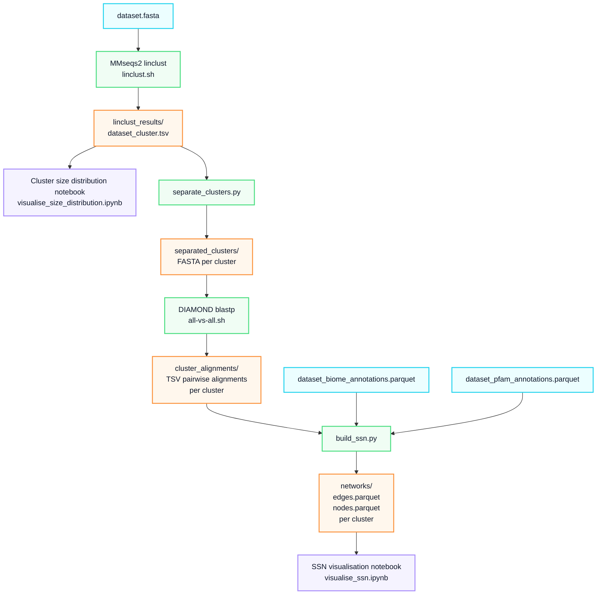
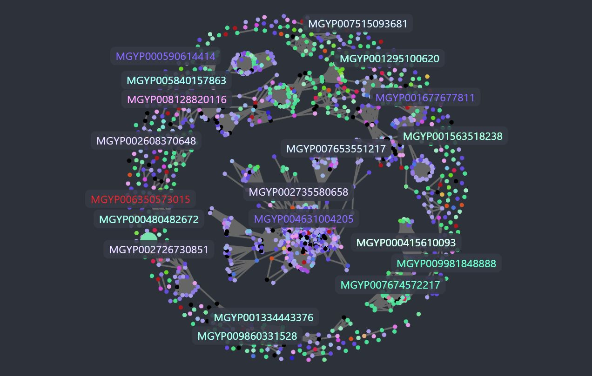
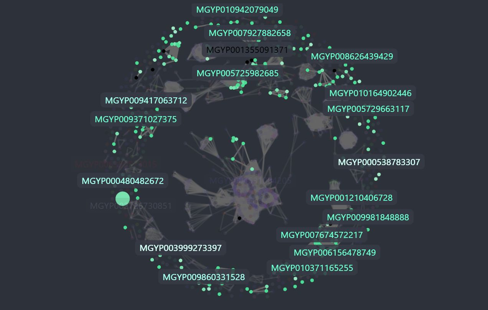
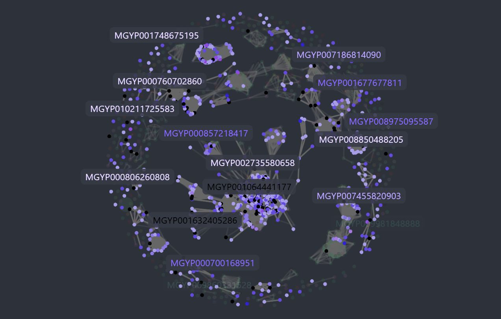
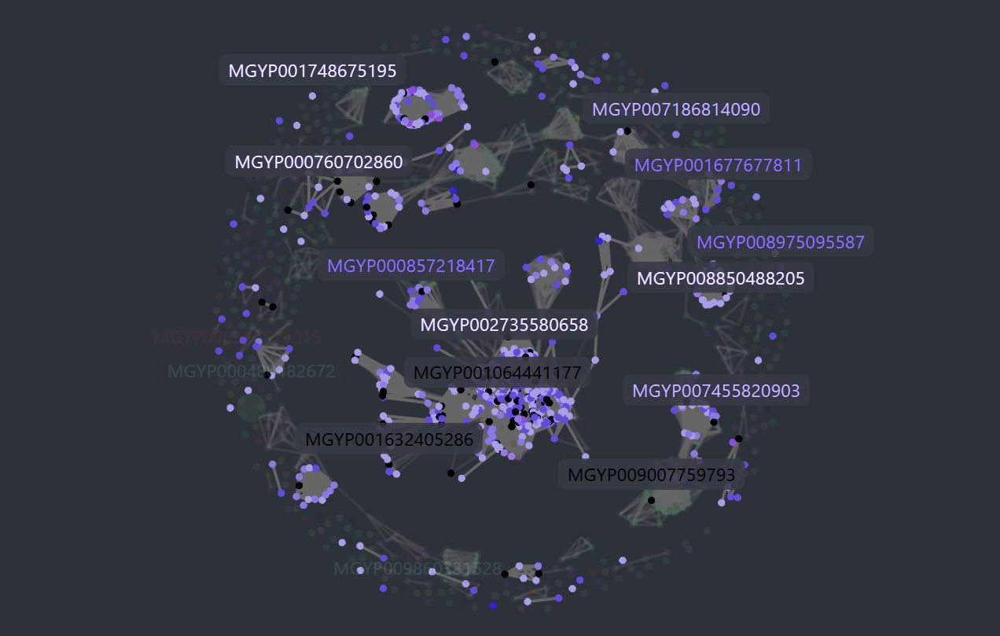

# Sequence similarity networks for the visualisation and exploration of MGnify Proteins

**Contributor:** [Szabolcs Vidám](https://github.com/vid-szabi)

**Mentors:** [Christian Atallah](https://github.com/chrisAta), [Ekaterina Sakharova](https://github.com/KateSakharova)

**Organisation:** [EMBL-EBI](https://www.ebi.ac.uk/)

**Programme:** [Google Summer of Code 2026](https://summerofcode.withgoogle.com/programs/2026/projects/SzccYhba)

    
  

## Project summary

The [latest release](https://ebi-metagenomics.github.io/blog/2026/07/17/MGnify-Proteins-Release/) of the [MGnify Proteins Database](https://www.ebi.ac.uk/metagenomics/proteins/) contains over 5.7 billion non-redundant protein sequences, with over 1.6 billion cluster representatives including relevant metagenomics metadata. Exploring and extracting meaningful functional, structural, and evolutionary insights from such a massive dataset requires highly efficient computational approaches. **Sequence Similarity Networks (SSNs)** are a powerful way to visualise and understand these protein-protein relationships.

Designed to meet this need, **MiSSN** is a pipeline that automates the generation of SSNs from large-scale protein sequence datasets. The pipeline handles everything from initial sequence redundancy reduction and all-vs-all alignments to metadata enrichment and formatting, outputting files ready for visualisation.

## Code

The entirety of the project is open-source under the Apache 2.0 license and managed within the [MiSSN GitHub repository](https://github.com/EBI-Metagenomics/MiSSN).

## What was built

---

### The core pipeline

The main deliverable is a four-step pipeline managed by a central shell script (`MiSSN.sh`). The steps are:

1. **Pre-clustering:** Using [MMseqs2](https://mmseqs.com/) (`easy-linclust`) for fast linear-time clustering to reduce sequence redundancy based on user-defined **sequence identity** and **coverage** thresholds.

2. **Separation:** Filtering clusters **by a minimum size** and splitting them into independent FASTA files.

3. **All-vs-all alignments:** Running [DIAMOND](https://github.com/bbuchfink/diamond) `blastp` on the isolated clusters to compute the precise **pairwise sequence alignments** necessary to build a complete graph.

4. **Network construction:** **Re-filtering** of the DIAMOND outputs, followed by **annotating** the nodes with complex metadata—specifically [*GOLD biome classifications*](https://gold.jgi.doe.gov/ecosystem_classification) and [*Pfam accessions*](https://www.ebi.ac.uk/interpro/entry/pfam/).

### Interactive visualisation notebooks

The frontend of the project consists of interactive notebooks designed for exploratory data analysis:

- **Cluster size distribution notebook** (`visualise_size_distribution.ipynb`): This notebook is designed to analyse the cluster size distribution, helping you accurately set or adjust the `<min_cluster_size>` parameter for the main pipeline.

- **SSN Visualisation Notebook** (`visualise_ssn.ipynb`): An interactive environment to load the generated `.parquet` network files, explore the sequence similarity networks visually, and interactively search/filter nodes by their biome and Pfam annotations. The high-performance network rendering is handled by [Cosmograph](https://cosmograph.app/).

## Technical specifications

**Core technologies used:** Python 3.13, MMseqs2, DIAMOND, Biopython, DuckDB, Cosmograph.

**Data formats:** Optimised for large-scale data handling using **Apache Parquet** for network edges and nodes, ensuring fast read/write speeds and low memory footprints.

**Configurability:** Users have control over the network generation, with adjustable thresholds for **minimum sequence identity**, **alignment coverage**, and **minimum cluster sizes**, plus dynamic coloring based on **biome hierarchy depths**.

## Stats

Throughout the project I have worked with four different datasets:

- **A subset of *MGnify 90*:** This dataset was extracted from the MGnify proteins database with 90% sequence identity. I used this to build the first couple steps of the pipeline, without annotating.

- **A subset of *MGnify 30*:** This dataset was extracted from the MGnify proteins database with 30% sequence identity. It matched our expectations more closely when setting our sequence identity threshold to 40% and alignment coverage to 80%. I worked with this dataset throughout building the last steps of the pipeline, supported by annotations.

- **A subset of full-length sequences:** This dataset consists entirely of complete protein sequences rather than partial fragments.

- **A small dataset:** A lightweight dataset (5,000 sequences) built specifically for rapid local development. I used this to quickly debug code changes, and verify end-to-end pipeline functionality locally in seconds.

The data below reflects pipeline executions configured with 40% sequence identity, 80% alignment coverage, and a minimum cluster size of 5.

| Dataset | Number of proteins | Number of clusters | Average cluster size | Biggest cluster size | Number of distinct biomes | Number of distinct Pfams |
|---|---|---|---|---|---|---|
| Subset of MGnify 90 (`gsoc_2026_test_set`) | 9,999,772 | 196,768 | 41.79 | 14,642 | - | - |
| Subset of MGnify 30 (`gsoc_2026_test_set2`) | 10,000,000 | 215,170 | 18.41 | 39,938 | 151 | 16,047 |
| Subset of full-length MGnify sequences (`gsoc_2026_test_set_full_length`) | 9,951,373 | 262,212 | 15.21 | 1,824 | 151 | 20,927 |
| Small dataset for testing (`gsoc_2026_test_set_small`) | 5,000 | 111 | 16.55 | 227 | 115 | 187 |

### Performance and execution time

All local computations were executed on a laptop equipped with a 12th Gen Intel Core i7-12700H processor (2.70 GHz), 16 GB of RAM (3200 MT/s), and an NVIDIA GeForce RTX 3060 Laptop GPU (6 GB).

For small datasets (5,000-20,000 sequences), the pipeline runs in approximately 10 seconds, making it practical for personal use on local machines. Processing the full large-scale datasets on an HPC cluster takes roughly 24 hours. Execution times are highly dependent on the chosen configuration parameters, and processing full-length sequences instead of partial sequences will significantly increase the total runtime.

### Visualisation preview

The following visualisations explore the largest cluster from the full-length sequences dataset, with the cluster representative `MGYP000480482672`.

#### The SSN
Unfiltered network with nodes colored by GOLD biome classifications.

#### Filtered by Marine
Highlighting nodes from marine environments, which includes the primary cluster representative.

#### Filtered by Human
Isolating sequences derived from human biomes.

#### Filtered by Human and PF00271
Applying a dual filter to isolate nodes that belong to human biomes and contain the Pfam accession PF00271.

## What's left / future work

- **Nextflow integration:** Porting the pipeline to Nextflow for better portability and reproducibility. Nextflow handles all the complex environment configurations and containers, allowing anyone to easily run the pipeline anywhere—from a laptop to the cloud—just by swapping out a configuration profile.

- **MMseqs2 coverage modes:** Experimenting with different coverage modes for `easy-linclust` to see how they impact the cluster representatives.

- **Tests and documentation:** Writing more tests and expanding the documentation to make the tool easier for others to pick up and use.

## Challenges and learnings

- **Running locally vs. HPC:** We wanted the pipeline to be usable on an average laptop too, not just on heavy cluster infrastructure. I quickly learned that using MMseqs2 for the all-vs-all alignments generates a massive amount of temporary files using up too much disk space. Switching to DIAMOND solved this storage issue and actually made the step faster.

- **Missing edges in alignments:** After initially running DIAMOND `blastp`, we noticed some expected edges were missing from the network. It turns out it is due to DIAMOND's sensitivity settings.

- **Choosing the right export format:** Standard formats like *CSV*, *TSV*, or *GraphML* were too big for networks with millions of edges. Switching to **Apache Parquet** and **DuckDB** was essential to keep the output sizes manageable.

- **Working with Cosmograph:** Because it is a newer library, it has some bugs and limitations. I had to build several custom workarounds from scratch to get the interactive filtering and search features working exactly the way we wanted.

- **Unexpected patterns:** We were surprised seeing that cluster representatives (the sequences picked by `linclust`) often ended up as singletons or only connected to a few other proteins in the final graph. We learned that this topology is actually a consequence of the specific coverage mode we used during the pre-clustering step.