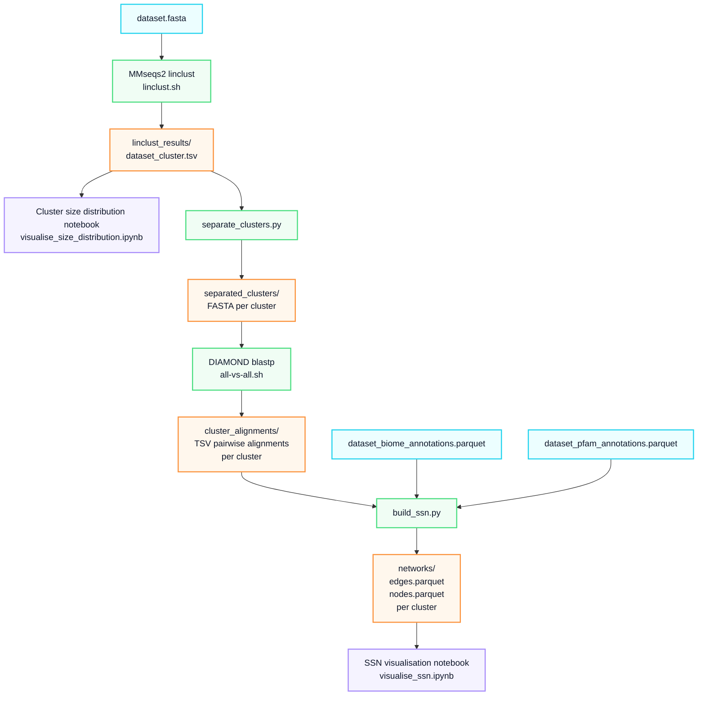

# MiSSN: A workflow for generating MGnify interactive Sequence Similarity Networks.

**Contributor:** [Szabolcs Vidám](https://github.com/vid-szabi)

**Mentors:** [Christian Atallah](https://github.com/chrisAta), [Ekaterina Sakharova](https://github.com/KateSakharova)

**Organisation:** EMBL-EBI

**Programme:** [Google Summer of Code 2026](https://summerofcode.withgoogle.com/programs/2026/projects/SzccYhba)

    
  

## Project summary

The MGnify Proteins Database currently holds **over 5.7 billion** non-redundant protein sequences. Exploring and extracting meaningful functional, structural, and evolutionary insights from such a massive dataset requires highly efficient computational approaches. **Sequence Similarity Networks (SSNs)** are a powerful way to visualize and understand these protein-protein relationships.

To solve this problem, we developed **MiSSN**, a pipeline for automating the generation of SSNs from large-scale protein sequence datasets. The pipeline handles everything from initial sequence redundancy reduction and all-vs-all alignments to metadata enrichment and formatting, outputting files ready for visualisation.

## Code

The entirety of the project is open-source under the Apache 2.0 license and managed within the [MiSSN GitHub repository](https://github.com/vid-szabi/MiSSN).

## What was built

---

### The core pipeline

The main deliverable is a four-step pipeline managed by a central shell script (`MiSSN.sh`). The steps are:

1. **Pre-clustering:** Utilizing MMseqs2 (`easy-linclust`) for fast linear-time clustering to reduce sequence redundancy based on user-defined **sequence identity** and **coverage** thresholds.

2. **Separation:** Filtering clusters **by a minimum size** and splitting them into independent FASTA files.

3. **All-vs-all alignments:** Running DIAMOND `blastp` on the isolated clusters to compute the precise **pairwise sequence alignments** necessary to build a complete graph.

4. **Network construction:** **Re-filtering** of the DIAMOND outputs, followed by **annotating** the nodes with complex metadata—specifically [*GOLD biome classifications*](https://gold.jgi.doe.gov/ecosystem_classification) and [*Pfam accessions*](https://www.ebi.ac.uk/interpro/entry/pfam/).

### Interactive visualisation notebooks

The frontend of the project consists of interactive notebooks designed for exploratory data analysis:

- **Cluster size distribution notebook** (`visualise_size_distribution.ipynb`): This notebook is designed to analyze the cluster size distribution, helping you accurately set or adjust the `<min_cluster_size>` parameter for the main pipeline.

- **SSN Visualisation Notebook** (`visualise_ssn.ipynb`): An interactive environment to load the generated `.parquet` network files, explore the sequence similarity networks visually, and interactively search/filter nodes by their biome and Pfam annotations.

## Technical specifications

**Core technologies used:** Python 3.13, MMseqs2, DIAMOND, Biopython, DuckDB, Cosmograph.

**Data formats:** Optimized for large-scale data handling using **Apache Parquet** for network edges and nodes, ensuring fast read/write speeds and low memory footprints.

**Configurability:** Users have control over the network generation, with adjustable thresholds for **minimum sequence identity**, **alignment coverage**, and **minimum cluster sizes**, plus dynamic coloring based on **biome hierarchy depths**.

## What's left / future work

- **Nextflow/nf-core integration:** Porting the pipeline to Nextflow/nf-core for better portability and reproducibility. Nextflow handles all the complex environment configurations and containers, allowing anyone to easily run the pipeline anywhere—from a laptop to the cloud—just by swapping out a configuration profile.

- **MMseqs2 coverage modes:** Experimenting with different coverage modes for `easy-linclust` to see how they impact the cluster representatives.

- **Tests and documentation:** Writing more tests and expanding the documentation to make the tool easier for others to pick up and use.

## Challenges and learnings

- **Running locally vs. HPC:** We wanted the pipeline to be usable on an average laptop too, not just on heavy cluster infrastructure. I quickly learned that using MMseqs2 for the all-vs-all alignments generates a massive amount of temporary files using up too much disk space. Switching to DIAMOND solved this storage issue and actually made the step faster.

- **Missing edges in alignments:** After initially running DIAMOND `blastp`, we noticed some expected edges were missing from the network. It turns out it is due to DIAMOND's sensitivity settings.

- **Choosing the right export format:** Standard formats like *CSV*, *TSV*, or *GraphML* were too big for networks with millions of edges. Switching to **Apache Parquet** and **DuckDB** was essential to keep the output sizes manageable.

- **Working with Cosmograph:** Because it is a newer and library, it has some bugs and limitations. I had to build several custom workarounds from scratch to get the interactive filtering and search features working exactly the way we wanted.

- **Unexpected patterns:** We were surprised  investigating that cluster representatives (the sequences picked by `linclust`) often ended up as singletons or only connected to a few other proteins in the final graph.